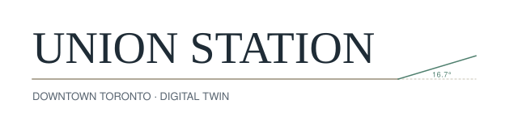
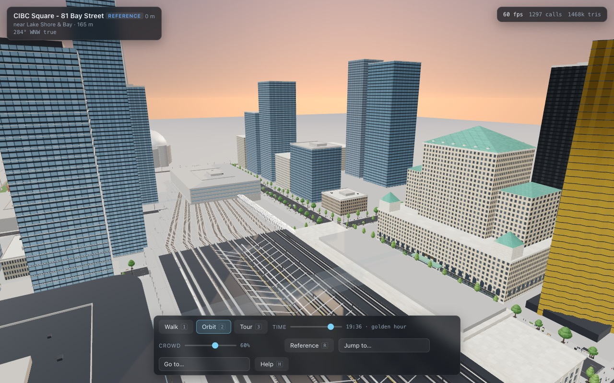
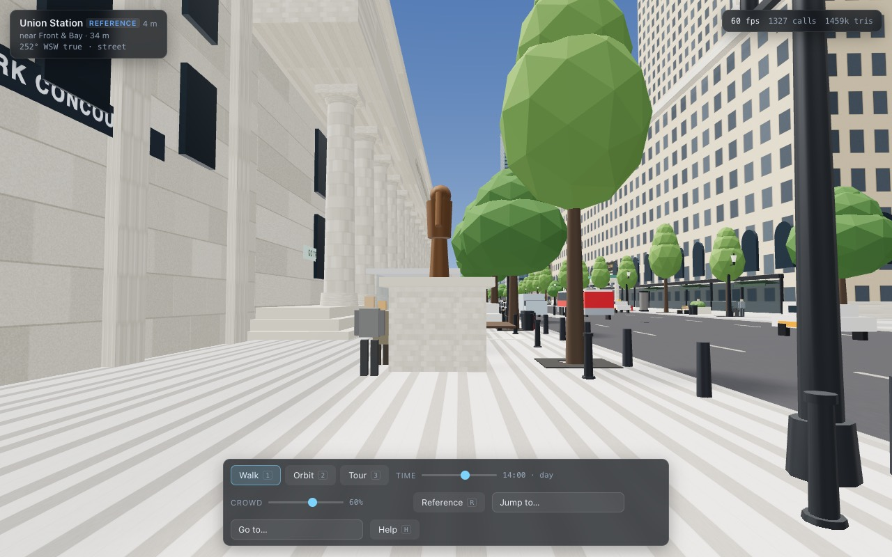
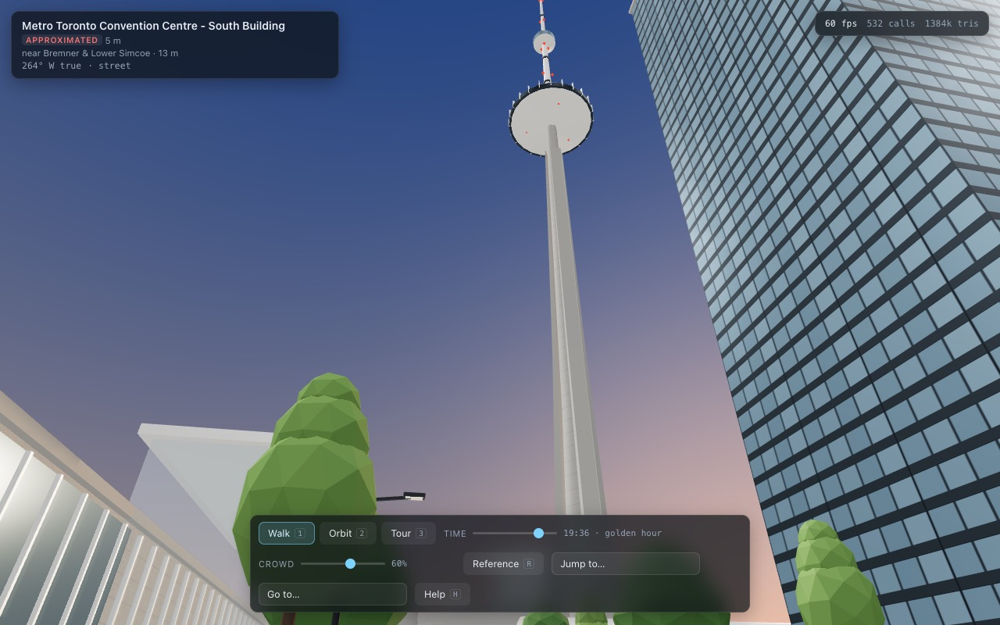

<p align="center">
  <picture>
    <source media="(prefers-color-scheme: dark)" srcset="docs/logo-dark.svg">
    
  </picture>
</p>

<p align="center">
  An interactive, browser-scale 3D reconstruction of Union Station and the blocks around it — every polygon written by hand, no external assets.
</p>

<p align="center">
  
  
  
  
  <a href="LICENSE"></a>
</p>

<p align="center">
  <a href="#quick-start">Quick start</a> — <a href="#the-things-that-make-it-toronto">Toronto invariants</a> — <a href="#controls">Controls</a> — <a href="#how-it-is-built">Architecture</a> — <a href="#qa">QA</a> — <a href="#licences-and-provenance">Provenance</a>
</p>

<p align="center">
  
</p>

<p align="center">
  
  
</p>

> **Demo:** coming soon. Until then, the quick start below puts the whole city on
> your screen in about thirty seconds.

Walk Front Street, enter the Great Hall, descend into the PATH, ride the SkyWalk
over the tracks, and watch trains, traffic and pedestrians move through a city
whose geometry is anchored to real coordinates.

Built from [`PROMPT.md`](PROMPT.md), which is the brief this repository was
produced from, reproduced verbatim.

---

## Quick start

```bash
npm install
npm run dev        # http://127.0.0.1:5173
```

Then open the URL and click once to capture the pointer. Two more scripts matter:

```bash
npm run build      # production bundle
npm run qa         # static QA -> FINAL_QA_REPORT.md, non-zero exit on any error
```

No API keys, no downloads, no data files. Node 20+ and a browser with WebGL 2.

---

## What is reconstructed

**Boundary** — King Street to the north, Lake Shore Boulevard (with the Gardiner
deck above it) to the south, Lower Simcoe to the west extending to John Street
for the Rogers Centre, Church Street to the east.

**Hero geometry**

| | |
|---|---|
| Union Station | head house, the 22-column Front Street colonnade, the entablature with its incised **railway** names, forecourt, train shed |
| Interiors | the Great Hall and its carved destination frieze, the York / Bay / VIA concourses, the Allen Lambert Galleria, a walkable PATH network, the Hockey Hall of Fame |
| North side | Fairmont Royal York and its copper château roof, Royal Bank Plaza's gold glass |
| East | Brookfield Place, the reassembled heritage bank façades, the Hockey Hall of Fame's 1885 bank building, Meridian Hall, the Gooderham Flatiron |
| South | Scotiabank Arena with its preserved 1941 postal-building façades, CIBC Square and The Park bridging the tracks, Maple Leaf Square |
| Southwest | the CN Tower, the Rogers Centre, Ripley's Aquarium, the John Street Roundhouse |
| Infrastructure | the rail viaduct and its four underpasses, the Gardiner deck, the SkyWalk, the below-grade streetcar loop |

**Systems** — pedestrians on a sidewalk graph, traffic on real lane geometry,
diesel GO / VIA / UP Express consists arriving and dwelling, a full day/night
cycle driven by the real solar position for Toronto's latitude.

---

## The things that make it Toronto

The reconstruction is organised around the handful of facts that separate this
place from a generic North American downtown, each of which is enforced by an
automated check in [`qa/traps.mjs`](qa/traps.mjs):

- **The grid is rotated 16.7° west of true north**, following Augustus Jones'
  1793–97 township survey laid parallel to the shoreline. Every shadow, every
  sunset down a street canyon and every skyline bearing depends on it.
- **The rail corridor is elevated.** Bay, York, Yonge and *Lower* Simcoe pass
  underneath it. Simcoe Street itself ends at Front.
- **The corridor is not electrified.** No catenary anywhere — GO, VIA and UP
  Express run diesel here, and wire would not fit under the heritage shed.
- **There is no streetcar track on Front Street.** Streetcars reach Union
  entirely below grade, through the Bay Street tunnel into the Union Loop.
- **The Gardiner is over Lake Shore**, south of the rail corridor — not over Front.
- **The carved frieze of Canadian destinations is inside the Great Hall.** The
  Front Street entablature carries railway names only.
- **The Hockey Hall of Fame's stained-glass dome is interior.** From the street
  the roofline is a plain skylight enclosure over carved Ohio freestone.
- **Toronto is a two-level city.** PATH / street / viaduct deck / platform /
  SkyWalk / Gardiner deck is the vertical layering the whole scene is built on.

---

## Controls

| | |
|---|---|
| `W A S D` / arrows | walk |
| mouse | look (click to capture the pointer) |
| `Shift` | run |
| `Space` | jump — a hop, for clearing a bollard; height is still `Q`/`E` |
| `Q` / `E`, `PgDn` / `PgUp` | change level — PATH, concourse, street, viaduct, platform, SkyWalk, Gardiner |
| `1` `2` `3` | walk / orbit / cinematic tour |
| `R` | reference mode |
| `T` | start the tour |
| `H` | help |
| `Esc` | close panels, release the pointer |
| click a storefront | tenant card, with its verification grade |
| `F` | open the storefront under the reticle (walking, pointer captured) |
| `M` | minimap while walking; click a viewpoint dot to jump there |

---

## How it is built

```
src/core/       geo transforms, renderer context, procedural textures,
                the shared material library, the scene registry
src/data/       the street grid, the building database, the tenant census,
                reference viewpoints
src/world/      streets, the generic façade builder, rail corridor, Gardiner,
                SkyWalk, forecourt
src/landmarks/  one module per hero building
src/interiors/  Great Hall, concourses, Galleria, PATH, Hockey Hall of Fame
src/systems/    pedestrians, vehicles, trains, street furniture, vegetation,
                signage, time of day
src/ui/         camera modes, HUD, cinematic tour, reference mode
qa/             the automated QA harness
```

Every module exports exactly `build(ctx)` and returns a `THREE.Object3D`;
[`MODULE_CONTRACT.md`](MODULE_CONTRACT.md) is the full contract, including
registration and the draw-call budget.

### Coordinate system

Real WGS84 coordinates are converted to a **grid-aligned local frame** by
[`src/core/geo.js`](src/core/geo.js): `+X` is grid east along Front Street, `-Z`
is grid north along Bay Street, `+Y` is metres above the Front & Bay street
datum. The 16.7° rotation lives in that one transform and nowhere else, so
nothing downstream can apply it twice or forget it.

The street grid and block geometry are **authored in metres** rather than as
per-building latitude/longitude guesses. Relative spacing is what makes the
scene read as Toronto; an error in the absolute anchor is a rigid-body offset of
the whole city. `localToGeo` emits WGS84 for any point on demand.

### Assets

There are none. Every texture is generated procedurally into a canvas at load
time ([`src/core/textures.js`](src/core/textures.js)), every piece of geometry is
constructed in code, and every wordmark is drawn as original lettering. The
runtime loads no images, fetches no URLs and ships no third-party 3D data.
Google Earth and Street View were used as **visual reference only** — no
proprietary mesh or imagery is redistributed here. `qa/traps.mjs` enforces this
by scanning the source for loaders, fetches and remote URLs.

### Honesty about tenants

Ground-floor retail downtown turns over on a scale of months. The tenant census
grades every entry, and the reconstruction renders a **generic category word**
("CAFE", "PHARMACY") rather than a brand name for any frontage it could not
verify. Clicking a storefront shows you which grade you are looking at.
[`FINAL_QA_REPORT.md`](FINAL_QA_REPORT.md) lists every uncertain tenant by name.

---

## QA

```bash
npm test           # unit tests
npm run qa         # static audit -> FINAL_QA_REPORT.md
npm run e2e        # Playwright, one suite at a time
```

`npm run qa` runs the geometric audit (footprint overlaps, buildings standing in
roadways, boundary containment, the geo transforms' round-trip, the CN Tower's
bearing and distance from Union Station), the hallucination-trap audit, and the
registry integrity check, then writes
[`FINAL_QA_REPORT.md`](FINAL_QA_REPORT.md). It exits non-zero on any error, so it
can gate a build.

Runtime figures — FPS, draw calls, triangle count, crowd sizes — are captured
separately from a live page and folded into the same report.

---

## Contributing

Issues and pull requests are welcome. Before you start:

- [`CLAUDE.md`](CLAUDE.md) — the short version: commands, the module contract,
  the coordinate frame, and the Toronto invariants.
- [`MODULE_CONTRACT.md`](MODULE_CONTRACT.md) — the full build contract,
  registration rules and the performance budget.
- [`qa/traps.mjs`](qa/traps.mjs) — the machine-checked invariants. If a change
  trips one of these, the change is wrong, not the trap.

Conventions: branch `<topic>-<issue#>` (for example `hud-29`); commit
`type: lowercase summary` per [conventional
commits](https://www.conventionalcommits.org/), appending `(#issue)` when one
exists; merge by pull request, squash only (`gh pr merge --squash`).
`npm test` and `npm run qa` must pass before review.

---

## Licences and provenance

The code is MIT licensed — see [`LICENSE`](LICENSE). The reconstruction itself
carries the obligations below.

- Reconstructed from public reference: OpenStreetMap, City of Toronto Open Data
  (3D Massing, Building Outlines, Toronto Centreline, Sidewalk Inventory,
  street-furniture datasets), published building documentation and public
  photography.
- **OpenStreetMap is ODbL 1.0 with share-alike.** Geometry here is *reconstructed
  from* reference rather than derived from a redistributed OSM database, and no
  OSM data ships in this repository.
- **Open Government Licence – Toronto** requires attribution for City data:
  *Contains information licensed under the Open Government Licence – Toronto.*
- Every figure in the building database carries a confidence grade. Anything
  graded below `reference` is a hypothesis, and the QA report says so.
- No brand's logotype or signage artwork is reproduced. Wordmarks in the scene
  and the mark at the top of this file are original lettering.
